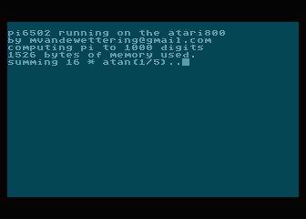
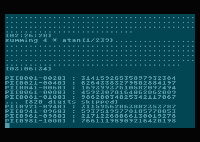

# pi6502

Back when I was a teenager with my first Atari 400 computer, I wanted to write all sorts of 
programs that were beyond my capability.  One of them was to calculate pi to a relatively
large number of digits.  
According to the [Wikipedia entry on the Chronology of computation of pi](https://en.wikipedia.org/wiki/Chronology_of_computation_of_%CF%80), pi wasn't computed to more than a thousand decimal places until Levi B. Smith
and John Wrench achieved 1,120 digits with a desk calculator.  I thought a reasonable target would be
around 1,000 digits, matching the largest calculation that was done in the pre-digital computer era.

This implementation is _very far_ from the most efficient possible on a 6502.  

- It is written in C, compiled with the cc65 compiler.  C is far from the best choice
for an 8 bit processor like the 6502.
- I had chosen the data representation to basically be BCD, where each byte stores two
digits.  But since this was written in C, it doesn't understand BCD at all.  This means that
there are a bunch of multiply, divide and modulo operations of 100, which would be vastly
better if they were performed in actual BCD.  This probably makes the program run 10x or even
100x slower than what it could be if it were really coded to use BCD mode.
- I didn't even tune the multiply or similar operations to be efficient choices.  This is basically
a line for line copy of a version that I wrote for Unix, with only the faintest trappings to make 
it work with CC65.

As a result, it runs rather slowly.  It takes 3 hours, 6 minutes and 34 seconds. 

For those of you who (for some reason) might want to run this, I have included the binary in the 
respository.
